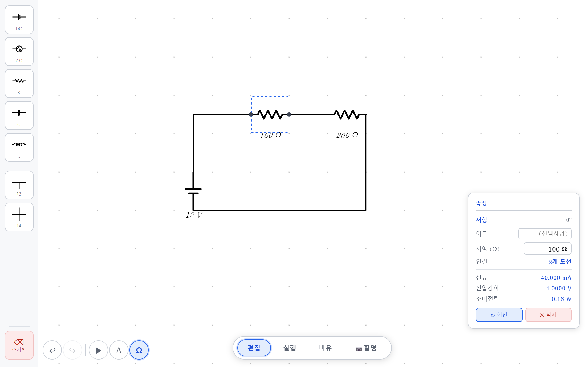
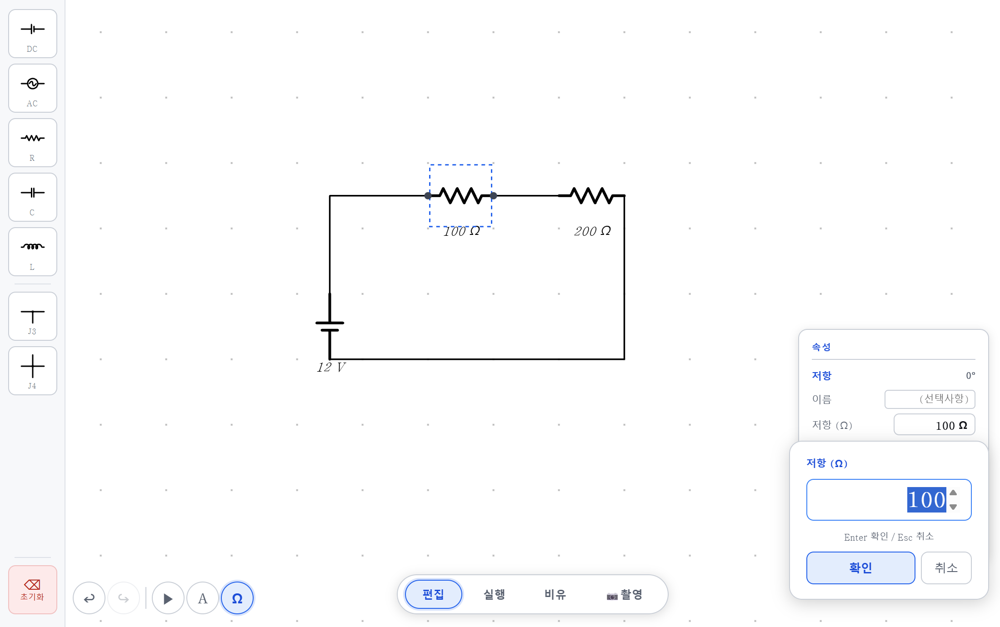
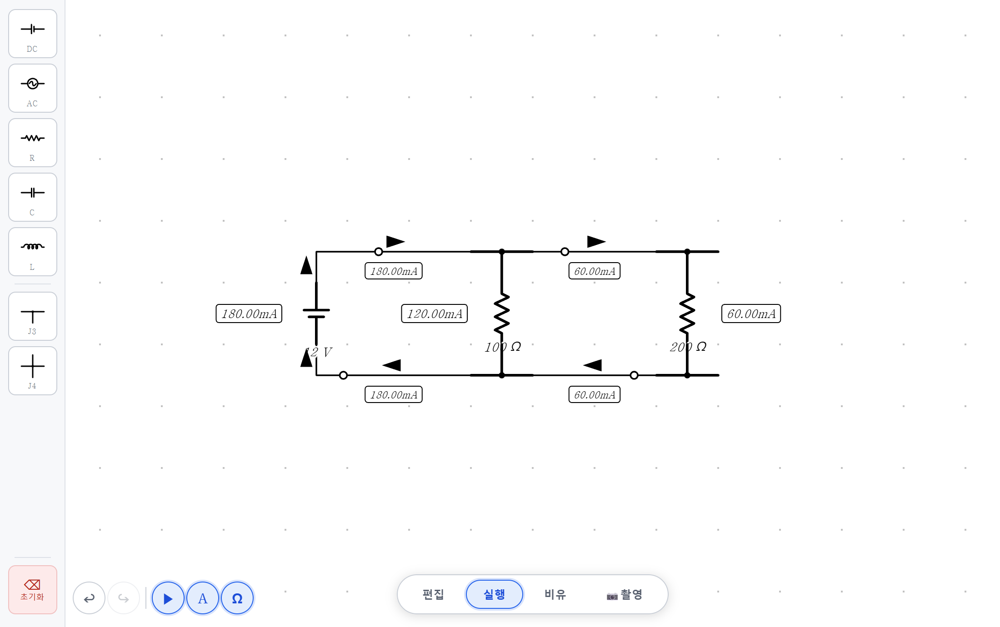
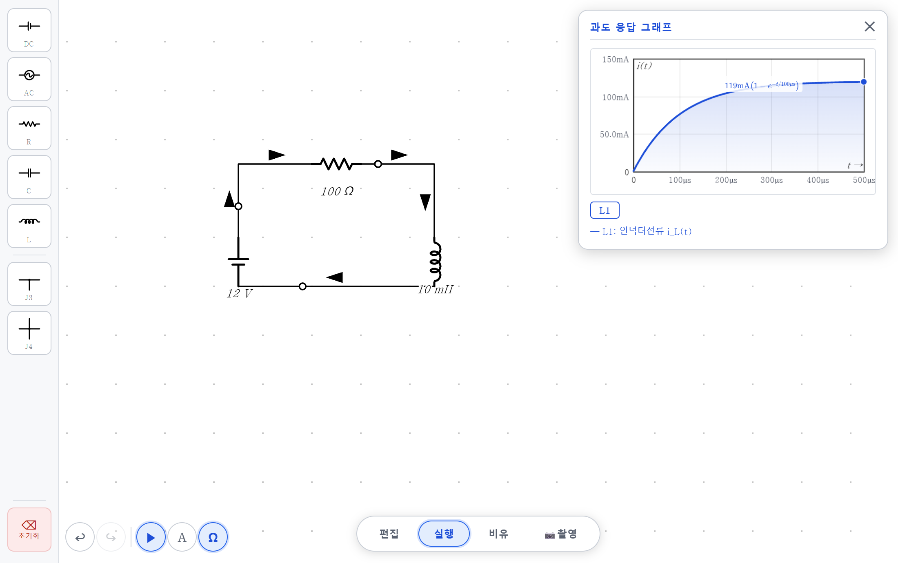
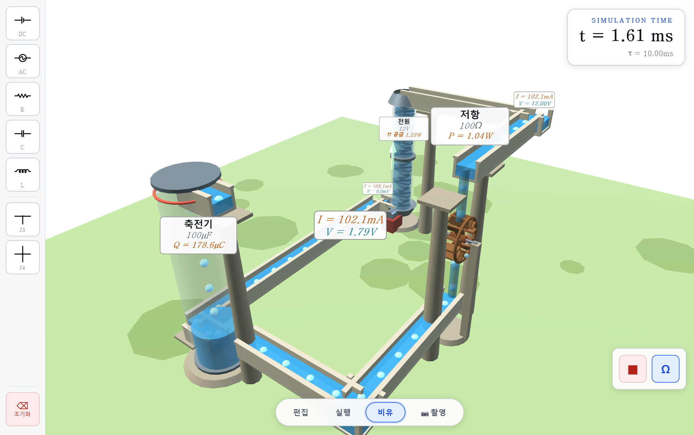
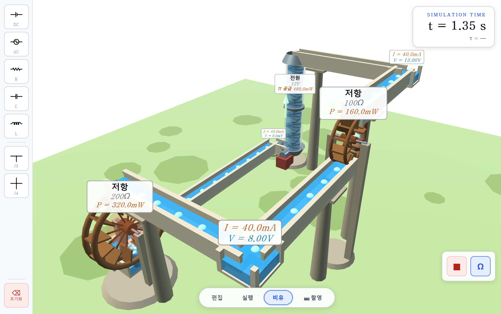
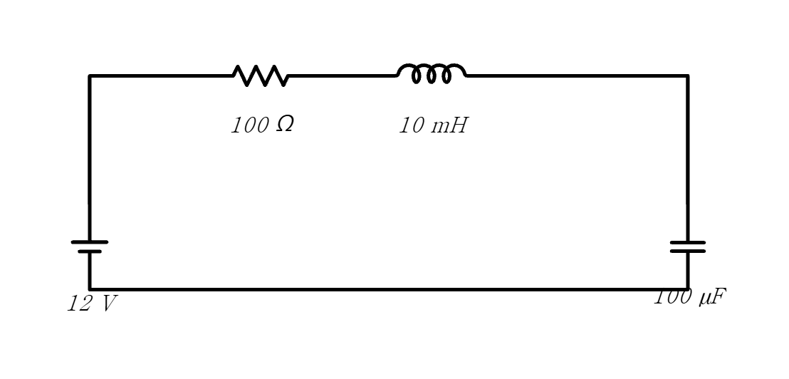
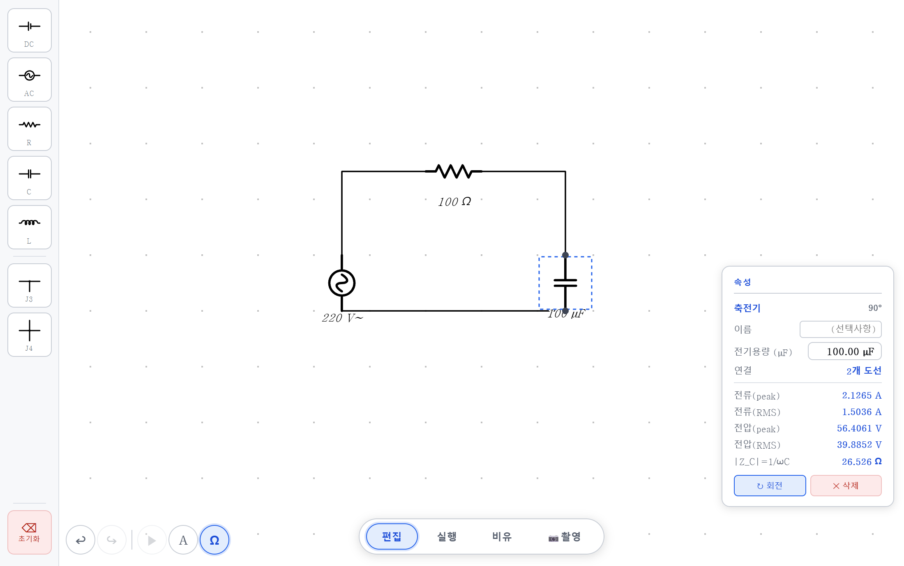
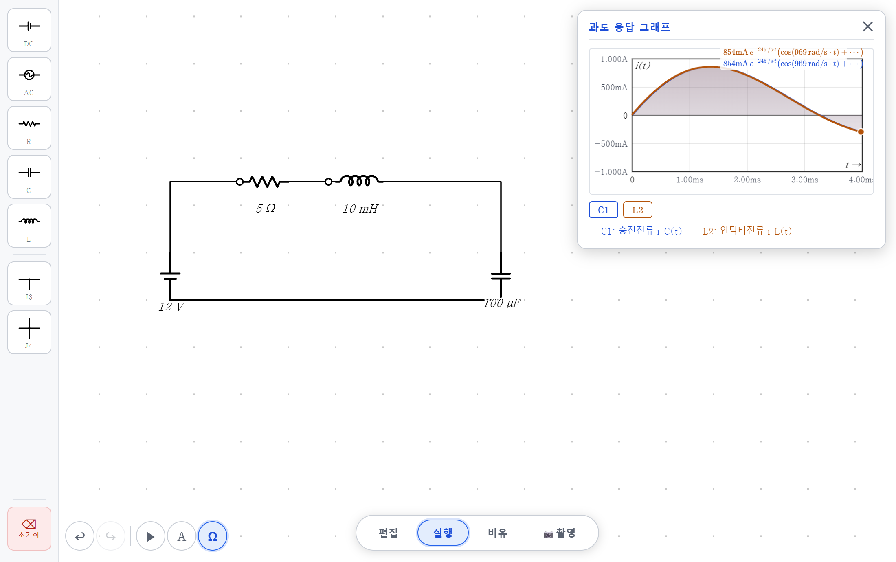
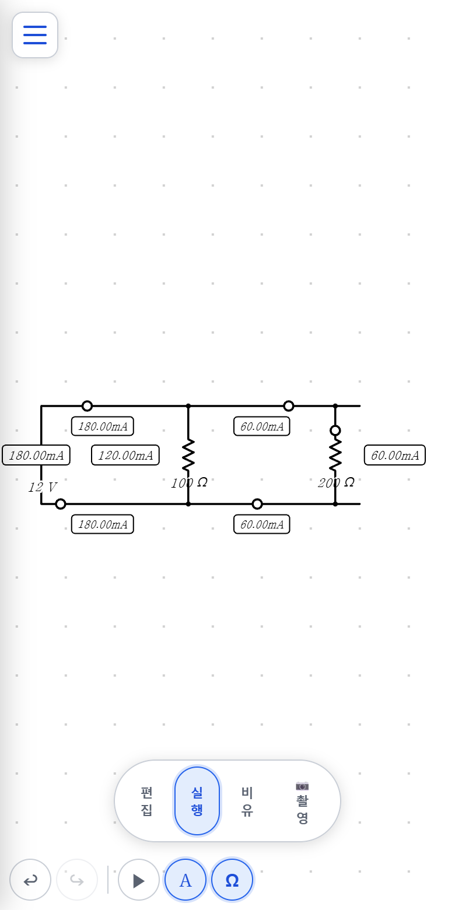

# 전기회로 시뮬레이터 ⚡

> **전지에 저항을 하나 이으면 전류는 얼마나 흐를까?**
>
> 식으로는 `I = V/R`, 한 줄입니다. 그런데 저항을 두 배로 키우면 무엇이 절반이 되는지,
> 축전기가 "다 차면" 왜 흐름이 멈추는지, 코일에서는 왜 전류가 **천천히** 올라가는지 —
> 회로도만 보고는 잘 넘어가지 않습니다.

격자에 소자를 놓고 도선으로 이으면 **그 자리에서 회로를 풀어** 전위·전압·전류를 보여 주는
웹 시뮬레이터입니다. 전자가 흐르는 모습, 회로를 그대로 옮긴 **물의 수로**,
**과도 응답 그래프**, 그리고 시험지에 그대로 붙일 수 있는 **선화 내보내기**까지 한 화면에 있습니다.

### 👉 [**바로 실행하기**](https://shy.ai.kr/circuit_simulation/)

설치·회원가입 없이 브라우저에서 바로 열립니다. PC·태블릿·스마트폰 모두 지원합니다.



---

## 5분 수업 도입

왼쪽 팔레트에서 **DC** 와 **R** 을 하나씩 끌어다 놓고 도선으로 이으세요.
저항을 클릭하면 오른쪽에 **전류·전압강하·소비전력**이 바로 뜹니다.
이제 **저항 값만** 이 순서대로 바꿔 보세요 (전압 12 V 고정).

| 저항 | 전류 | 소비전력 | 무슨 이야기 |
|---|---|---|---|
| **100 Ω** | 120.000 mA | 1.44 W | 기준 |
| **200 Ω** | 60.000 mA | 0.72 W | 저항 2배 → 전류 **정확히 절반** |
| **300 Ω** | 40.000 mA | 0.48 W | 저항 3배 → 전류 **1/3** |
| **50 Ω** | 240.000 mA | 2.88 W | 저항 절반 → 전류 2배 |

여기서 저항을 하나 **더** 이어 붙이면 이야기가 두 갈래로 갈립니다.

| 어떻게 잇는가 | 전체 전류 | 각 저항이 받는 것 |
|---|---|---|
| **직렬** (100 Ω + 200 Ω) | 40 mA — 하나였을 때보다 **줄어듦** | 전압이 나뉨: **4 V / 8 V** |
| **병렬** (100 Ω ∥ 200 Ω) | 180 mA — 하나였을 때보다 **늘어남** | 전류가 나뉨: **120 mA / 60 mA** |

> 🔥 **이 두 줄이 회로 단원의 절반입니다.**
> 직렬은 **전압**을 나누고, 병렬은 **전류**를 나눕니다.
> 병렬에서 120 + 60 = 180 이 정확히 맞아떨어지는 것 — 그게 키르히호프 전류 법칙입니다.

---

## 네 개의 모드

화면 아래 가운데 **편집 · 실행 · 비유 · 📷촬영** 버튼으로 오갑니다.

### ✏️ 편집 — 회로를 그린다

왼쪽 팔레트(**DC · AC · R · C · L · J3 · J4**)에서 소자를 **끌어다 놓으면** 격자에 붙습니다.
**포트가 맞닿으면 도선이 저절로 생기고**, 떨어져 있으면 포트(●)를 누른 채 끌어서 잇습니다.

값을 바꾸려면 소자를 **더블클릭**하거나, 속성 패널의 값 버튼을 누르세요.



회로가 완성되는 즉시 풀립니다. **계산 버튼은 없습니다** — 값을 하나 고치면 그 순간 모든 수치가 바뀝니다.

### ▶️ 실행 — 전자가 흐른다



움직이는 작은 알갱이는 **전자**입니다. 그래서 **전류 화살표와 반대 방향으로** 흐릅니다.
전류가 클수록 **빠르고 촘촘하게** 지나갑니다.

왼쪽 아래 세 버튼이 표시를 켜고 끕니다.

| 버튼 | 켜면 보이는 것 |
|---|---|
| **▶** | 전류의 방향 화살표 (관례적 전류 방향 — 전자와 반대) |
| **A** | 도선마다 전류의 **크기 배지** |
| **Ω** | 소자의 특성값 (100 Ω, 12 V, 100 µF …) |

> 위 그림이 **키르히호프 전류 법칙**의 전부입니다. 갈라지기 전 180 mA,
> 갈라진 뒤 120 mA 와 60 mA, 다시 합쳐져 180 mA.

**축전기(C)나 코일(L)이 들어 있으면** 실행 모드에서 **과도 응답 그래프**가 함께 열립니다.



12 V · 100 Ω · 10 mH 회로의 코일 전류입니다. 그래프에 **식이 직접 적힙니다** —
`i(t) = 119 mA (1 − e^(−t/100µs))`. 시상수 `τ = L/R = 10 mH / 100 Ω = 100 µs` 가
그대로 나온 값이고, 최종값 120 mA 는 `V/R` 입니다.

### 🌊 비유 — 회로가 수로가 된다



같은 회로를 **야외 수로**로 바꿔 놓은 화면입니다. 들어가면 물이 멈춰 있고,
오른쪽 아래 **▶** 를 눌러야 흐르기 시작합니다. 오른쪽 위에 **경과 시간 t 와 시상수 τ** 가 뜹니다.

| 전기 | 수로에서는 | 눈으로 보이는 것 |
|---|---|---|
| **전압(전위)** | 수로의 **높이** | 전위가 높은 노드가 물리적으로 더 높이 있습니다 |
| **전류** | 물의 **유속** | 전류가 클수록 물살이 빠릅니다 |
| **전원 (DC)** | **양수 펌프장** | 나선 양수기가 낮은 물을 높은 수로로 퍼올립니다 |
| **도선** | 교각 위 **열린 수로** | 등전위라 거의 수평입니다 |
| **저항 (R)** | **물레방아 + 폭포** | 낙차 = 전압강하, 물레방아가 하는 일 = 소비전력 |
| **축전기 (C)** | **저수탑** | 수위가 차오르는 것이 충전. 유입 수로 높이까지 차면 흐름이 멎습니다 |
| **인덕터 (L)** | 무거운 **주철 플라이휠 수차** | 관성 때문에 유속이 서서히 붙습니다 |
| **분기점 (J3·J4)** | 갈림길 **수반** | 들어온 물과 나간 물이 같습니다 (= KCL) |



100 Ω 과 200 Ω 을 **직렬**로 이은 회로입니다. 같은 물이 두 물레방아를 차례로 지나가지만
(= 전류는 같지만) **낙차가 다릅니다** — 200 Ω 쪽 낙차가 두 배이고, 하는 일도 두 배(320 mW 대 160 mW)입니다.

카메라: **휠 = 확대·축소**, **왼쪽 드래그 = 이동**, **오른쪽 드래그 = 시점 회전**.
모바일에서는 핀치 = 확대, 한 손가락 = 이동, 두 손가락 = 시점 회전입니다.

> ⚠️ **교류 회로는 비유 모드로 들어갈 수 없습니다.** 물이 1초에 60번 방향을 바꾸는 그림은
> 도움이 되기보다 헷갈리기 때문입니다.

### 📷 촬영 — 시험지에 붙일 그림

**📷촬영** 을 누르면 지금 회로가 **흰 바탕·검정 선 PNG** 로 저장됩니다.



- 격자·선택 표시·전자·화살표는 빠지고 **회로 그림만** 남습니다
- 내용에 맞게 **자동으로 잘라내고** 3배 해상도로 그립니다 — 학습지에 확대해 붙여도 깨지지 않습니다
- **화면을 얼마나 확대해 두었든 결과는 같습니다**
- `Ω` 버튼이 켜져 있으면 소자 값도 함께 찍힙니다

수능 물리 문항 그림의 작도 규격(흰 바탕·검정 선·기울인 수식 서체)을 따랐습니다.
근거와 대조표는 [`Design_Suneung_Comparison.md`](Design_Suneung_Comparison.md) 에 있습니다.

---

## 조작법

| 조작 | 하는 일 |
|---|---|
| 팔레트에서 **드래그** | 소자 배치 (포트가 맞닿으면 자동 연결) |
| 소자 **드래그** | 이동 — 왼쪽 아래 🗑 삭제존에 놓으면 삭제 |
| 포트(●) **누른 채 드래그** | 도선 연결 |
| **더블클릭** | 값 입력 팝업 |
| **우클릭** / 길게 누르기 | 회전 · 복제 · 삭제 메뉴 |
| 빈 곳 **드래그** | 화면 이동 (관성) |
| **휠** / 핀치 | 확대·축소 (0.25배 ~ 4배) |
| 도선의 **◇ 핸들** | 꺾임 방향 전환 (ㄱ 자 ↔ ㄴ 자) |
| `R` | 선택한 소자 90° 회전 |
| `Delete` · `Backspace` | 선택한 것 삭제 |
| `Esc` | 선택·연결 취소 |
| `Ctrl+Z` / `Ctrl+Shift+Z` · `Ctrl+Y` | 실행 취소 / 다시 실행 (30단계) |
| 팔레트 맨 아래 **초기화** | **1.2초 길게 누르면** 회로 전체 삭제 |

---

## 화면 읽는 법

### 속성 패널 (소자를 클릭하면 오른쪽에)

직류 회로에서는 **전류 · 전압강하 · 소비전력**이 뜹니다. 소자에 따라 줄이 더 붙습니다.

| 소자 | 함께 보여 주는 값 |
|---|---|
| **축전기 C** | 충전량 `Q = CV`, **+극판/−극판 전하**, 병렬이면 총 충전량과 전하 보존(ΣQ₊ = ΣQ₋) |
| **인덕터 L** | 자속 `Φ = LI`, 자기에너지 `½LI²` |
| **전원** | 공급전력 |

정상상태에서 축전기에는 `DC 개방`, 인덕터에는 `DC 단락` 배지가 붙습니다.
**"왜 축전기 전류가 0인가"** 를 묻기 좋은 자리입니다.

### 교류 회로일 때



교류에서는 **피크값과 실효값(RMS)을 나란히** 보여 주고, 소자별 임피던스도 함께 뜹니다.

| 표시 | 뜻 |
|---|---|
| **전류(peak) / 전압(peak)** | 진폭 |
| **전류(RMS) / 전압(RMS)** | 실효값 = 피크 ÷ √2 |
| **\|Z_C\| = 1/ωC**, **\|Z_L\| = ωL** | 그 주파수에서 축전기·코일이 내는 "저항" |
| **소비전력(평균)** | `V_rms × I_rms` |

> 📐 **AC 전원에 적는 값은 진폭(peak)입니다.** 220 V 로 두면 실효값은 155.6 V 입니다.
> 콘센트의 "220 V"(실효값)와 같게 맞추려면 **311 V** 를 넣어야 합니다 — 그 자체로 좋은 발문입니다.
>
> 교류에서는 방향이 계속 바뀌므로 **전류 방향 화살표(▶) 버튼이 자동으로 꺼집니다.**

### 과도 응답 그래프

`L` 이나 `C` 가 있는 직류 회로에서 실행 모드에 들어가면 열립니다.
소자가 여럿이면 위쪽 토글(`L1` `C1` …)로 곡선을 켜고 끕니다.
곡선 위의 **식은 그려진 파형에서 직접 뽑아낸 것**이라, 값을 바꾸면 식도 함께 바뀝니다.

---

## 수업에서 이렇게 써 보세요

### 활동 1. 옴의 법칙을 손으로 확인하기 `기초`

> **발문** — "저항을 두 배로 하면 전류는 어떻게 될까? 예상하고, 확인해 보자."

12 V 전지 하나에 저항 하나. 값을 50 → 100 → 200 → 300 Ω 으로 바꾸며 전류를 기록합니다.

- 학생이 찾을 규칙: **전류 × 저항이 항상 12 로 일정** (`V = IR`)
- 이어지는 발문: "그럼 소비전력 1.44 W 는 어디서 나온 숫자일까?" (`P = VI = V²/R`)

### 활동 2. 직렬 — 전압은 어떻게 나뉘는가 `기초`

> **발문** — "100 Ω 과 200 Ω 을 한 줄로 이으면, 12 V 는 어떻게 나뉠까?"

각 저항을 클릭해 전압강하를 읽게 합니다.

| 저항 | 전류 | 전압강하 |
|---|---|---|
| 100 Ω | 40 mA | **4 V** |
| 200 Ω | 40 mA | **8 V** |
| 합 | — | **12 V** |

- 두 저항의 **전류가 같다**는 것을 먼저 확인시키세요. 전압이 저항에 비례해 나뉜다는 것은 그다음입니다.
- 비유 모드에서 보면 물레방아 두 개가 **같은 물살**을 받되 **낙차가 다릅니다** (위 클로즈업 사진).

### 활동 3. 병렬 — 전류는 어떻게 나뉘는가 (KCL) `기초` ⭐

> **발문** — "이번엔 나란히 이었다. 전지에서 나오는 전류는 늘어날까, 줄어들까?"

`A` 버튼을 켜서 배지를 보이게 하고 실행 모드로 들어갑니다 (위 실행 화면).

| 위치 | 전류 |
|---|---|
| 전지 쪽 도선 | **180 mA** |
| 100 Ω 가지 | 120 mA |
| 200 Ω 가지 | 60 mA |

- 학생이 발견할 것: **갈라진 전류의 합 = 갈라지기 전 전류** (KCL)
- 전체 저항은 `12 V ÷ 180 mA = 66.7 Ω` — **두 저항 중 어느 것보다도 작습니다.**
  "저항을 더 붙였는데 전체 저항이 줄어드는" 이 지점이 학생들이 가장 많이 틀리는 곳입니다.

### 활동 4. 축전기는 왜 직류를 막는가 `심화`

> **발문** — "축전기를 직렬로 넣었더니 전류가 0 이다. 처음부터 0 이었을까?"

12 V · 100 Ω · 100 µF 회로를 만들고 **비유 모드**에서 ▶ 를 누르게 하세요.

- 저수탑의 **수위가 차오르는 동안에는 물이 흐릅니다.** 유입 수로 높이까지 차면 멎습니다.
- 오른쪽 위 HUD 의 **τ = 10.00 ms** 가 곧 `τ = RC = 100 Ω × 100 µF` 입니다.
- 다 찬 뒤 편집 모드로 돌아와 축전기를 클릭하면 **충전량 Q = 1.20 mC**(`= CV`)와
  `DC 개방 (정상상태)` 배지가 보입니다.

> **이어지는 발문** — "저항을 200 Ω 으로 키우면 다 차는 데 걸리는 시간은?" (τ 가 2배)
> "축전기를 200 µF 로 키우면?" (역시 2배 — 그런데 최종 충전량도 2배)

### 활동 5. 코일은 왜 전류를 천천히 올리는가 `심화`

> **발문** — "스위치를 닫는 순간 전류는 곧바로 120 mA 가 될까?"

12 V · 100 Ω · 10 mH 로 만들고 실행 모드의 그래프를 봅니다 (위 그래프 사진).

- `τ = L/R = 100 µs`. 그래프의 식에 그대로 적혀 나옵니다.
- 비유 모드에서는 **무거운 플라이휠**이 서서히 도는 것으로 보입니다 — 관성이 곧 인덕턴스입니다.
- 인덕터를 클릭하면 자속 `Φ = LI` 와 자기에너지 `½LI²` 가 함께 나옵니다.

> **비교 발문** — "축전기는 처음에 잘 흐르다 멈추고, 코일은 처음에 안 흐르다 흐른다. 왜 정반대일까?"

### 활동 6. RLC — 언제 진동하는가 `심화` ⭐



12 V · **5 Ω** · 10 mH · 100 µF 직렬 회로입니다. 전류가 솟았다가 **0 아래로 내려갔다가**
다시 올라오며 잦아듭니다 — 감쇠 진동입니다.

> **발문** — "저항만 키우면 이 출렁임은 언제 사라질까?"

저항을 5 → 10 → 20 → 50 Ω 으로 올리며 그래프 모양을 관찰하게 합니다.

- 경계는 `R = 2√(L/C) = 2√(10 mH ÷ 100 µF) =` **20 Ω**
- 그보다 작으면 **감쇠 진동**, 크면 진동 없이 잦아듭니다 (과감쇠).
  20 Ω 에서는 `cos` 이 식에서 사라지는 것을 확인할 수 있습니다.
- 그래프 식의 `e^(−245/s·t)` 와 `cos(969 rad/s·t)` 는 이론값
  `α = R/2L = 250 /s`, `ω_d = √(1/LC − α²) = 968 rad/s` 와 거의 같습니다.
  (그래프의 계수는 그려진 파형에서 되짚어 추정한 값이라 끝자리가 조금 다릅니다.)
- 곡선은 **가장 크게 흐른 방향을 +로** 잡아 그립니다. 저항을 바꿔도 위아래가 뒤집히지 않으므로
  여러 값의 그래프를 그대로 겹쳐 비교할 수 있습니다.

> 💡 그네를 밀지 않고 손으로 잡아 두면 흔들림이 곧 멎습니다 — 저항이 하는 일이 바로 그것입니다.

### 활동 7. 교류에서 축전기는 저항이 될까 `심화`

220 V · 60 Hz 교류에 100 Ω 과 100 µF 를 직렬로 답니다 (위 교류 화면).

> **발문** — "직류에서는 축전기가 전류를 완전히 막았다. 교류에서도 그럴까?"

축전기를 클릭하면 `|Z_C| = 1/ωC = 26.53 Ω` 이 뜹니다. 전류는 흐릅니다.

| 주파수 | \|Z_C\| | 전류(peak) |
|---|---|---|
| 6 Hz | 265.3 Ω | 0.78 A |
| 60 Hz | 26.5 Ω | 2.13 A |
| 600 Hz | 2.7 Ω | 2.20 A |

- **주파수가 높을수록 축전기는 덜 막습니다.** 직류(0 Hz)는 완전히 막히는 그 극단입니다.
- 코일로 바꿔 같은 실험을 하면 **정반대**(`|Z_L| = ωL`)라는 것이 다음 활동입니다.

### 활동 8. 시험지 그림 만들기 `수업 준비`

문항에 넣을 회로를 그린 뒤 **📷촬영**. 흰 바탕·검정 선 PNG 가 저장됩니다.
`Ω` 버튼을 끄면 값이 빠진 **빈 회로도**가 되어, 값을 묻는 문항으로 쓸 수 있습니다.

---

## 관련 단원

| 과목 | 연결되는 내용 |
|---|---|
| 통합과학 · 물리학Ⅰ | 전압·전류·저항, 옴의 법칙, 전기 에너지와 전력 |
| **물리학Ⅱ** | **직렬·병렬 회로, 키르히호프 법칙, RC·RL 과도 현상, 축전기와 유도계수, 교류 회로와 임피던스** |
| 전기·전자 (직업계) | 회로 해석, 시상수, 실효값 |
| 융합·창의 | 회로 시뮬레이션, 물리 모형과 비유의 한계 |

---

## 이 시뮬레이터가 단순화한 것

수업에서 **함께 짚어 주세요.** 좋은 발문 소재가 됩니다.

| 단순화 | 실제라면 |
|---|---|
| **도선의 저항은 0** | 실제 도선에도 저항이 있어 아주 긴 배선에서는 전압이 떨어집니다 |
| **이상적인 전원** | 실제 전지에는 내부 저항이 있어, 큰 전류를 뽑으면 단자 전압이 내려갑니다 |
| **스위치·전구·다이오드 없음** | 지금 있는 소자는 전원(DC·AC) · R · C · L · 분기점뿐입니다 |
| **교류는 한 주파수만** | 주파수가 다른 교류 전원을 섞으면 해석을 거부합니다 (페이저 해석의 한계) |
| **교류에는 비유 모드 없음** | 물이 초당 60번 방향을 바꾸는 그림은 비유로서 도움이 되지 않습니다 |
| **온도·소자 오차 없음** | 실제 저항은 뜨거워지면 값이 변하고, 부품마다 ±5 % 쯤 다릅니다 |
| **비유 모드의 "물"은 전자가 아님** | 수로는 **이해를 돕는 모형**입니다. 물은 새지만 전하는 보존되고, 물은 중력으로 흐르지만 전자는 전기장으로 흐릅니다 |

> 💬 **좋은 발문** — "수로 비유에서 물레방아를 떼어 내면 물은 그냥 콸콸 흐른다. 회로에서 저항을 떼면 어떻게 될까?"
> (→ 단락. 실제로 저항을 지우고 이어 보면 `단락 회로가 감지되었습니다` 가 뜹니다.)

---

## 스마트폰에서도 됩니다



세로·가로 모드를 모두 지원합니다. 왼쪽 위 **☰** 로 소자 팔레트를,
**ℹ** 로 속성 패널을, **📈** 로 그래프를 엽니다.
학생 개인 기기로 각자 탐구하게 하기 좋습니다 — 링크만 공유하면 됩니다.

👉 https://shy.ai.kr/circuit_simulation/

---

## 자주 묻는 질문

**Q. 회로를 그렸는데 아무 값도 안 나옵니다.**
소자를 클릭했을 때 속성 패널에 뜨는 메시지를 보세요.

| 메시지 | 뜻 |
|---|---|
| `전원이 없습니다` | DC 나 AC 전원을 하나 넣어야 합니다 |
| `회로가 열려 있습니다` | 어떤 소자가 다른 소자들과 이어지지 않고 떨어져 있습니다 |
| `단락 회로가 감지되었습니다` | 전원의 두 극이 저항 없이 곧바로 이어졌습니다 |
| `서로 다른 전압의 전원이 병렬 연결되어 있습니다` | 12 V 와 9 V 를 나란히 이으면 물리적으로 모순입니다 |
| `주파수가 서로 다른 교류 전원…` | 교류는 한 번에 한 주파수만 해석합니다 |

**Q. 도선이 엉뚱한 곳으로 꺾여요.**
도선 가운데의 **◇ 핸들**을 누르면 꺾임 방향이 ㄱ 자 ↔ ㄴ 자로 바뀝니다.
(속성 패널의 `꺾임 방향` 버튼도 같은 일을 합니다.)

**Q. 소자를 지우고 싶어요.**
선택한 뒤 `Delete`, 또는 왼쪽 아래 🗑 삭제존으로 끌어다 놓으세요.
전부 지우려면 팔레트 맨 아래 **초기화**를 **1.2초 길게** 누릅니다.

**Q. 축전기 전류가 0 으로 나옵니다. 고장인가요?**
정상입니다. 직류의 **정상상태**에서 축전기는 열린 회로입니다.
전류가 흐르던 **과도 구간**은 실행 모드의 그래프나 비유 모드에서 볼 수 있습니다.

**Q. 인터넷 없이 쓸 수 있나요?**
한 번 열어 두면 창을 닫기 전까지는 동작합니다. 파일을 내려받아 `index.html` 을
더블클릭해도 대부분 열리지만, **비유 모드의 물리 엔진**만은 로드되지 않을 수 있습니다
(이 경우에도 같은 계산식으로 자동 대체되어 화면은 정상 동작합니다).

**Q. 만든 회로를 파일로 저장할 수 있나요?**
저장·불러오기 기능은 아직 없습니다. **📷촬영**으로 그림을 남기세요.

**Q. 수업 자료로 마음대로 써도 되나요?**
네. 수정·배포·재사용 모두 자유롭게 하셔도 됩니다.

---

## 직접 실행하기 / 고쳐 쓰기

```bash
git clone https://github.com/sehunYang/circuit_simulation.git
cd circuit_simulation
python -m http.server 8000     # → http://localhost:8000
```

빌드 도구도 패키지 설치도 필요 없는 **순수 정적 웹앱**입니다.

수업에 맞게 바꾸고 싶은 값들:

| 바꾸고 싶은 것 | 파일 |
|---|---|
| 소자의 기본값 (12 V, 100 Ω, 100 µF …) | `src/js/core/constants.js` 의 `SIDEBAR_ITEMS` |
| 격자 한 칸 크기 · 확대 범위 | `src/js/core/constants.js` 의 `CELL_SIZE`, `SCALE_MIN`·`SCALE_MAX` |
| 실행 취소 단계 수 | `src/js/core/constants.js` 의 `UNDO_MAX` |
| 색상·서체 | `src/styles/tokens.css` |
| 수로 비유의 모양과 색 | `src/js/render/analogy-renderer.js` |
| 내보내는 PNG 해상도 | `src/js/render/capture.js` 의 `PNG_SCALE` |

물리 검증:

```bash
node tests/run-tests.js     # 해석해와 대조하는 30개 시나리오 (140+ 검증)
```

구조와 설계 의도는 **[ARCHITECTURE.md](ARCHITECTURE.md)** 에 정리돼 있습니다.

---

<sub>만든이 · 양세훈 | 교실에서 자유롭게 쓰세요</sub>
